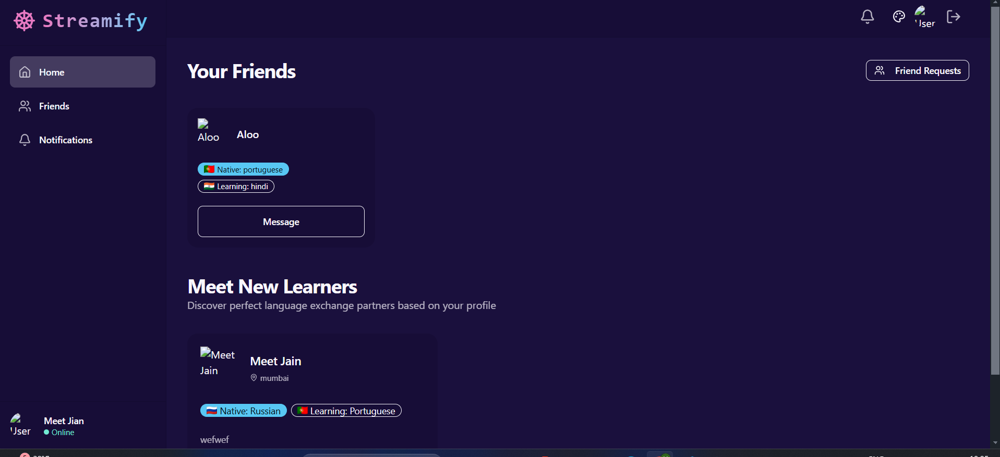

# ✨ Fullstack Chat & Video Calling App ✨

## Highlights

- 🌐 Real-time Messaging with Typing Indicators & Reactions
- 📹 1-on-1 and Group Video Calls with Screen Sharing & Recording
- 🔐 JWT Authentication & Protected Routes
- 🌍 Language Exchange Platform with 32 Unique UI Themes
- ⚡ Tech Stack: React + Express + MongoDB + TailwindCSS + TanStack Query

---

## Project Overview

This project is a fullstack chat and video calling application that supports real-time messaging, video calls with screen sharing and recording, user authentication with JWT, and a language exchange platform with multiple UI themes. The backend is built with Express and MongoDB, while the frontend uses React, Vite, and TailwindCSS.

---

## Environment Variable Setup

### Backend (`/backend`)

Create a `.env` file in the `backend` directory with the following variables:

```
PORT=5001
MONGO_URI=your_mongo_uri
STEAM_API_KEY=your_steam_api_key
STEAM_API_SECRET=your_steam_api_secret
JWT_SECRET_KEY=your_jwt_secret
NODE_ENV=development
```

### Frontend (`/frontend`)

Create a `.env` file in the `frontend` directory with the following variable:

```
VITE_STREAM_API_KEY=your_stream_api_key
```

---

## Running the Backend

Navigate to the `backend` directory, install dependencies, and start the development server:

```bash
cd backend
npm install
npm run dev
```

Available scripts:

- `dev`: Runs the server with nodemon for development (auto-restart on changes)
- `start`: Runs the server with Node.js

---

## Running the Frontend

Navigate to the `frontend` directory, install dependencies, and start the development server:

```bash
cd frontend
npm install
npm run dev
```

Available scripts:

- `dev`: Starts the Vite development server
- `build`: Builds the production-ready frontend
- `lint`: Runs ESLint to check code quality
- `preview`: Previews the production build locally

---

## Tech Stack Summary

### Backend

- Node.js with Express
- MongoDB with Mongoose
- Authentication with JWT
- Real-time features with Stream Chat SDK
- Other dependencies: bcryptjs, cookie-parser, cors, dotenv

### Frontend

- React with Vite
- TailwindCSS and DaisyUI for styling
- React Query for data fetching
- Stream Video React SDK for video calls
- State management with Zustand
- Routing with React Router

---

## Screenshot



---

## Additional Notes

- Ensure you have MongoDB running and accessible via the `MONGO_URI`.
- Replace all placeholder environment variables with your actual keys.
- For any issues or contributions, please open an issue or pull request.
